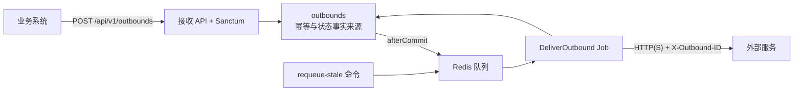

# Outbound 投递服务设计

## 1. 业务边界

业务系统调用本服务的内部 API。服务先把请求写入数据库，事务提交后再推入 Redis，由 Worker 投递到外部 HTTP(S) 接口：



这里不负责业务事件产生，也不承诺外部业务 exactly-once。`succeeded` 只表示目标接口返回了 2xx。

## 2. API 契约

### 提交

`POST /api/v1/outbounds`

请求需要 Sanctum Bearer Token 和 `outbounds:create` ability，并且必须带以下请求头：

- `Idempotency-Key`：一次逻辑提交对应一个 key，最长 255 个字符。
- `Authorization: Bearer <token>`：调用方服务账号使用的 Sanctum Token。

请求体：

```json
{
  "target_url": "https://example.com/webhooks/outbounds",
  "http_method": "POST",
  "headers": {
    "Authorization": "Bearer <vendor-token>"
  },
  "payload": {
    "event": "invoice.created",
    "resource_id": "1001"
  }
}
```

当前只允许 `POST`、`PUT`、`PATCH`，目标 URL 只允许 `http` 和 `https`。

### 幂等规则

幂等范围是“调用方用户 + `Idempotency-Key`”。数据库通过唯一索引约束这一范围，另外保存规范化请求的 SHA-256 fingerprint：

| 场景 | 行为 |
| --- | --- |
| 首次使用 key | 创建一条 `queued` 投递并派发 Job，返回 202 |
| 相同 key、相同 fingerprint | 返回原投递，不创建第二条记录、不重复派发 Job |
| 相同 key、不同 fingerprint | 返回 409，提示 key 已绑定其他请求 |

这里把 `Idempotency-Key` 和 `Request-ID` 分开使用。前者解决 POST 重试造成的重复创建，后者用于链路追踪。每条投递还有一个内部 ULID，并通过 `X-Outbound-ID` 传给外部服务。

## 3. 状态与数据模型

核心模型叫 `Outbound`，表示一次发往外部系统的 HTTP 投递。这样也不会和 Laravel 的 `Notification` 类、通知渠道混在一起。

`OutboundStatus` 只有四个状态：

| 状态 | 说明 |
| --- | --- |
| `queued` | 首次等待投递或等待退避重试；不单独增加 `retrying` 状态 |
| `processing` | 当前 Job 已取得记录并开始执行 |
| `succeeded` | 外部接口返回 2xx，终态 |
| `failed` | 永久失败或自动重试耗尽，终态 |

`outbound_attempts` 记录每次尝试的序号、耗时、HTTP 状态和错误分类。重放时，当前轮次的 `attempt_count` 会归零，但历史序号继续递增，已有审计记录不会被覆盖。模型和表都使用 `Outbound` 命名。关联字段叫 `outbound_id`，但数据库不建外键；`outbounds.user_id` 使用 `unsignedBigInteger` 保存调用方 ID。

请求头使用 Laravel 的 `encrypted:array` cast 保存，供应商认证信息不会以明文直接落库。payload 仍按 JSON 保存；生产环境是否进一步加密或脱敏，取决于数据分级。

## 4. 投递可靠性

### 事务与派发

先在数据库事务中写入投递记录，事务提交后再使用 `afterCommit()` 派发 Job。这样事务回滚时，队列里不会留下找不到记录的 Job。

### 重试

Job 使用唯一锁，同一投递在 Redis 队列中只允许一个活动 Job。外部请求的连接超时是 5 秒，总超时是 15 秒；Job 超时为 30 秒，队列 `retry_after` 为 90 秒。

下面这些错误会触发重试：

- 网络连接异常、连接超时；
- HTTP 408、425、429；
- HTTP 5xx。

退避时间依次为 60 秒、5 分钟、15 分钟和 30 分钟。5 次尝试耗尽后，投递标记为 `failed`。其他 4xx 不自动重试，通常需要业务方先修正请求或凭证。

### Redis 与数据库职责

- Redis：只用来做异步队列和 Job 唯一锁。
- 数据库：保存请求、幂等 key、状态、最后一次错误和所有尝试记录。
- `outbounds:requeue-stale`：扫描到期的 `queued` 记录，以及超过 Redis `retry_after` 的 `processing` 记录，然后重新派发 Job。

因此，Redis 短暂不可用时，已经落库的请求不会丢失。Worker 恢复后，或运行补偿命令，可以把这些请求重新送回队列。补偿命令也需要纳入部署和监控流程。

## 5. 鉴权与安全

- API 使用 Sanctum Bearer Token。不提供 HTTP 用户名密码登录，也不提供匿名 Token 申请接口。
- `outbounds:create`、`outbounds:read`、`outbounds:replay` 分开控制。
- 服务 Token 通过 `outbounds:issue-token` Artisan 命令由管理员或部署流程签发。命令支持显式创建服务账号对应的 `User` 记录，不通过用户名密码登录获取 Token，只在终端输出一次明文 Token；调用方应立即将它保存到 Secret Manager。
- Policy 会限制状态查询和重放，调用方只能访问自己创建的投递。
- 供应商认证 header 加密保存，状态响应不返回原始 headers 或 payload。
- 当前示例允许调用方提交任意 HTTP(S) URL。正式使用前，需要增加目标域名 allowlist 或 SSRF 防护，禁止访问环回地址、内网地址和云元数据地址，同时处理 DNS 解析和重定向。

## 6. 当前取舍与后续演进

- Horizon 先不引入。MVP 只有一个投递队列，Laravel 原生 Worker 足够；需要队列监控、吞吐统计或多队列治理时再考虑。
- 独立的 service/repository 层也先不拆。当前的 Action、Job 和模型边界已经够用，没必要为了形式增加一层抽象。
- 服务账号目前复用 `User` 模型，Token、ability 和幂等作用域都按这个身份关联。如果以后需要区分普通用户、服务客户端或多租户，再抽出 `service_clients`。
- 如果外部供应商有自己的幂等协议，可以把 `X-Outbound-ID` 映射为对方的幂等字段。否则，本服务只能保证入口去重，不能保证外部副作用不重复。
